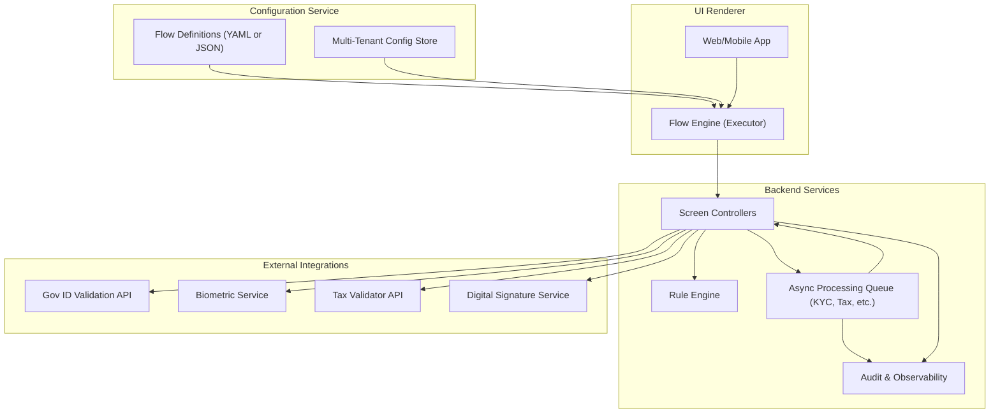
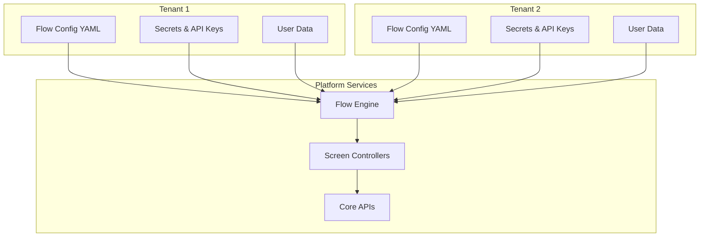
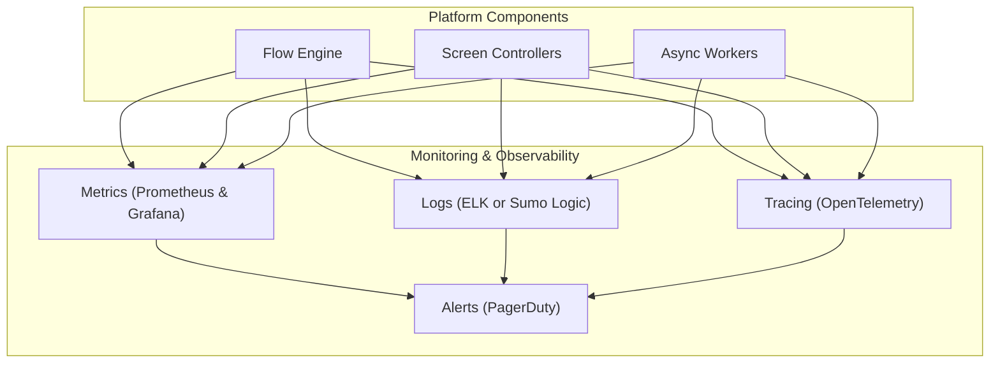
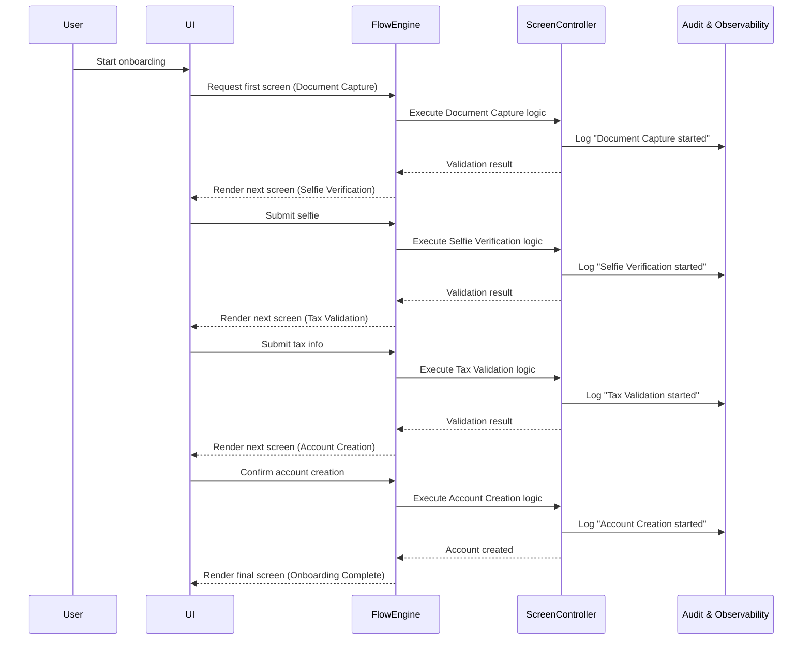
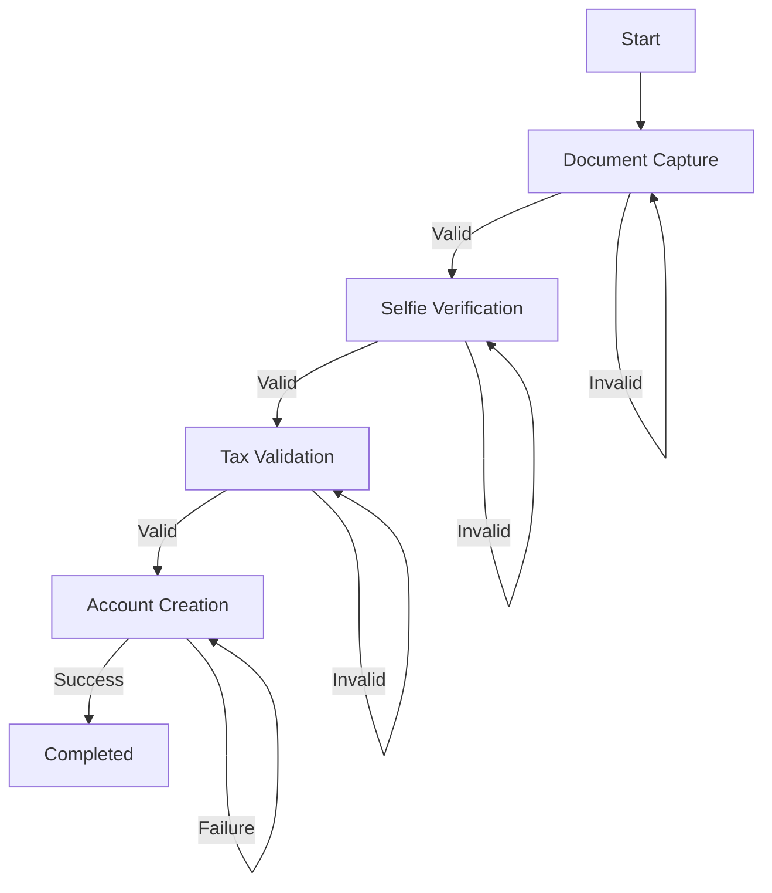
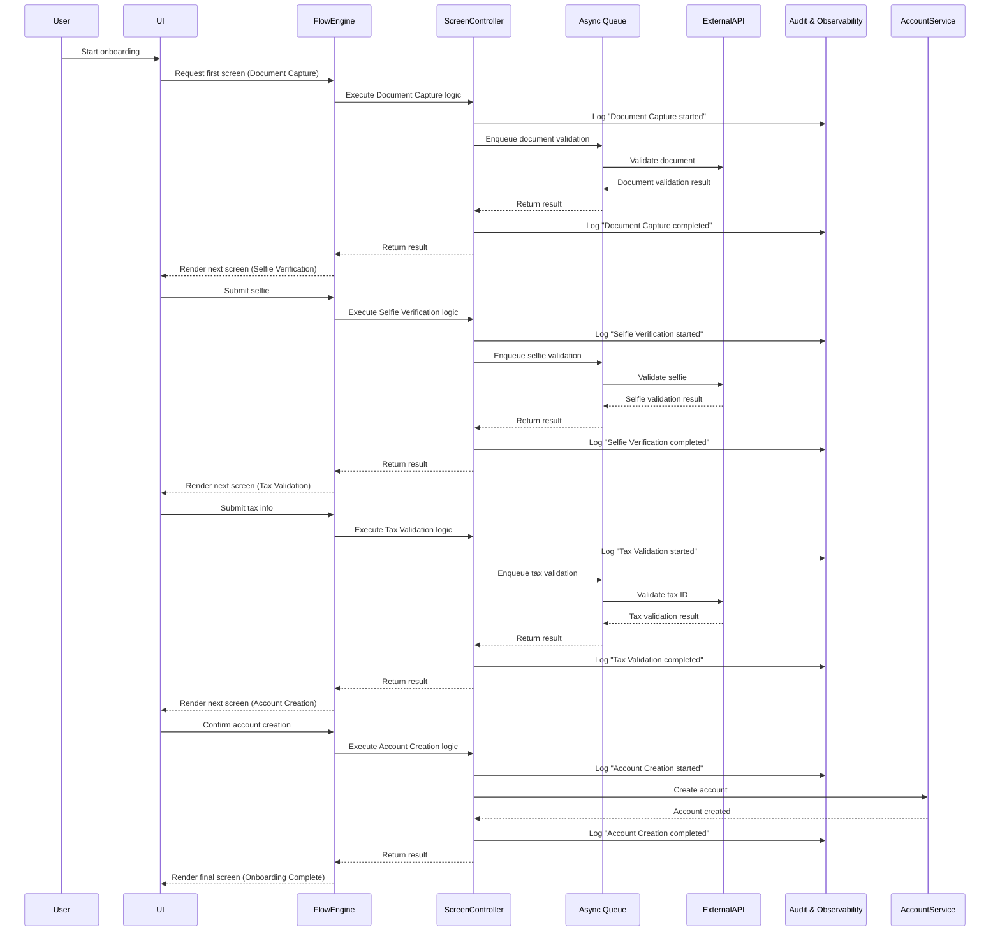
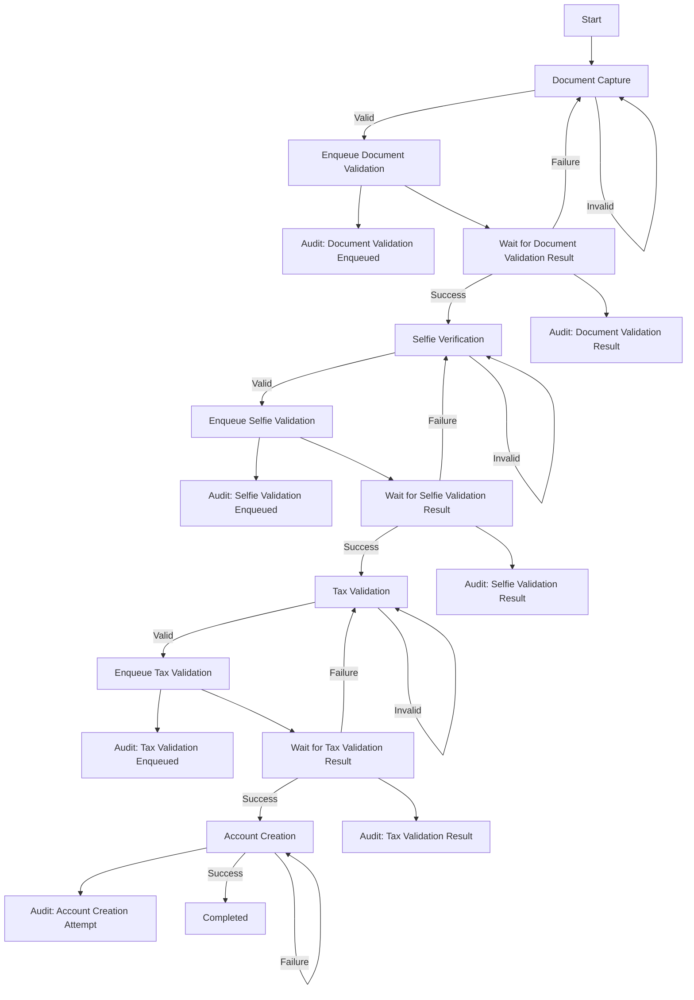

# Digiventures Onboarding Platform - Architecture Proposal

## 📑 Table of Contents
- [Architecture Overview](#-architecture-overview)
  - [Architecture Diagram](#architecture-diagram)
- [Key Features](#-key-features)
- [Technical Decisions](#-technical-decisions)
- [Multi-Tenant Model](#-multi-tenant-model)
- [Observability Dashboard](#-observability-dashboard)
- [Diagrams](#-diagrams)
- [Onboarding Flows](#-onboarding-flows)
- [Components](#-components)
- [Security & Compliance](#-security--compliance)
- [Summary](#-summary)


This repository documents the architecture for a **SaaS no-code onboarding platform** built for scalability, multi-tenancy, and extensibility.


## 📐 Architecture Overview

# Architecture Diagram



## 📝 Explanation
1. **Configuration Service:** Stores flow definitions (YAML/JSON) and tenant-specific settings.
2. **Frontend UI Renderer:** Loads the flow dynamically and renders screens.
3. **Backend Controllers:** Orchestrate business logic for each screen.
4. **Rule Engine:** Handles declarative logic like field validation and conditions.
5. **Async Queue:** For long-running tasks (e.g., KYC or credit checks).
6. **External Integrations:** APIs for ID verification, biometrics, tax validation, etc.
7. **Audit & Observability:** Centralized logging, metrics, and monitoring.
8. **UI (No-Code Player):** Renders screens dynamically based on flow definitions.


The platform is composed of four main layers:

1. **Configuration Layer**
   - Flow definitions (YAML/JSON) describing onboarding steps.
   - Tenant-specific configuration (branding, secrets, API keys).
2. **Execution Layer**
   - UI Renderer for web/mobile applications.
   - Flow Engine that dynamically interprets flow definitions and drives the onboarding experience.
3. **Backend Layer**
   - Screen Controllers that execute business logic.
   - Rule Engine for validations and conditional logic.
   - Async Processing Queue for long-running tasks.
   - Audit & Observability for compliance and debugging.
4. **External Integrations**
   - Third-party APIs for identity validation, biometrics, tax verification, and digital signatures.


## 🚀 Key Features


- **Modular Architecture** → Clear separation of flows, components, and backend services.
- **No-Code Flow Definition** → Clients configure onboarding steps declaratively.
- **Multi-Tenant Isolation** → Secure data separation with tenant-specific configurations.
- **Async Processing** → Queues for long-running tasks (e.g. tax validation, manual review).
- **Versioned Flows & Components** → Backward compatibility for existing clients.
- **Full Observability** → Metrics, logs, and auditing for compliance and monitoring.


## 🛠 Technical Decisions

This document explains the main architectural trade-offs and justifications for the **Digiventures Onboarding Platform**.

### 1. Flow Definitions (YAML/JSON)

- **Decision:** Use **YAML** (with optional JSON support) for onboarding flow definitions.
- **Why:**  
  - Human-readable format for product and compliance teams.
  - Supports versioning in Git for auditability.
  - Simple to parse and render in the Flow Engine.
- **Alternatives:** A custom rule engine or DSL.  
  - **Rejected:** Increases complexity and onboarding cost for clients. YAML is sufficient for early versions.

### 2. Multi-Tenant Configuration Service

- **Decision:** Centralize tenant configuration in a **Configuration Service**.  
- **Why:**  
  - Isolation of tenant-specific flows, secrets, and API keys.
  - Enables runtime resolution of tenant-specific endpoints and settings.
  - Prevents cross-tenant data leakage.
- **Alternatives:** Environment-based configuration or separate deployments per tenant.  
  - **Rejected:** Poor scalability and operational overhead.

### 3. Flow Engine

- **Decision:** A single **Flow Engine** service that executes flows in real-time.
- **Why:**  
  - Clear orchestration of screens, validations, and integrations.
  - Pluggable architecture to support new components (validators, processors).
  - Enables UI to dynamically render based on engine responses.

### 4. Rule Engine

- **Decision:** Integrate a **Rule Engine** inside backend services for conditional logic (e.g. tax rules per country).
- **Why:**  
  - Keeps validation logic decoupled from flow orchestration.
  - Supports future migration to externalized decision engines if complexity grows.

### 5. Async Processing Queue

- **Decision:** Use a **queue system** (e.g. SQS or Kafka) for long-running tasks such as tax validation or manual review triggers.
- **Why:**  
  - Prevents blocking API calls.
  - Improves resilience and scalability.
  - Supports event-driven workflows where results are pushed back to the **Screen Controllers**, which update the Flow Engine state.
- **Alternatives:** Synchronous blocking calls.
  - **Rejected:** Poor user experience and risk of timeouts.
- **Additional Note:**  
  - Async processing is fully auditable, and all results are correlated with the originating request in the Flow Engine.

### 6. Audit & Observability

- **Decision:** Add an **Audit & Observability Service** linked to the Flow Engine and Controllers.
- **Why:**  
  - Required for compliance (especially for regulated banking flows).
  - Enables replaying user journeys for debugging.
  - Metrics and tracing for performance monitoring.
- **Tools:** Prometheus, Grafana, OpenTelemetry, ELK, PagerDuty.

### 7. External Integrations

- **Decision:** Use external APIs for specialized validations:  
  - **Gov ID Validation API**
  - **Biometric Service**
  - **Tax Validator API**
  - **Digital Signature Service**
- **Why:**  
  - Leverages specialized providers with regulatory compliance.
  - Avoids reinventing the wheel for regulated services.

### 8. Versioning Strategy

- **Decision:**  
  - Version both **flows** and **components** (e.g. `onboarding_bank_v1.yaml`, `tax_validation_v2.yaml`).
  - Support backward compatibility for existing tenants.
- **Why:**  
  - Prevents breaking changes for active clients.
  - Enables incremental improvements without forced migrations.

### 9. Database Model

- **Decision:**  
  - Shared database schema with **tenant scoping** by default.
  - **DB-per-tenant** for highly regulated financial clients.
- **Why:**  
  - Balances operational efficiency with compliance needs.

### 10. Security

- **Decision:**  
  - Tenant-specific secrets in a secure vault (e.g. AWS Secrets Manager).
  - Encrypted fields for PII.
  - Immutable audit logs.
- **Why:**  
  - Meets regulatory and security requirements.

### 11. UI Renderer

- **Decision:**  
  - UI is **dynamic**, driven by Flow Engine definitions.
- **Why:**  
  - Single UI can serve multiple tenants.
  - Reduces time-to-market for onboarding new flows.

---

## 🏢 Multi-Tenant Model



### 📝 Explanation
1. **Tenant Isolation**
   - Each tenant has its own configuration (YAML), API keys/secrets, and user data.
   - These are stored in separate namespaces or databases (e.g., PostgreSQL schemas or isolated collections in MongoDB).
   - For highly regulated clients, a **DB-per-tenant** deployment model is supported.
   - Secrets are managed using a secure vault (e.g., AWS Secrets Manager or HashiCorp Vault).
2. **Shared Platform Services**
   - The Flow Engine is multi-tenant aware: it loads the correct tenant configuration dynamically at runtime.
   - Screen Controllers and Core APIs are shared, but execute in the context of the tenant making the request.
3. **Security Boundaries**
   - Configurations and credentials are scoped to the tenant.
   - Strict access control ensures no cross-tenant data leakage.
4. **Hot Updates**
   - Tenants can update their configurations without redeploying the platform.
   - Configuration changes are versioned and validated before being applied.
5. **Scalability**
   - Shared services (Flow Engine, Controllers) can scale horizontally.
   - Tenant-specific resources (like secrets and user data) remain isolated.


## 📊 Observability Dashboard




### 📝 Explanation
1. **Metrics (Prometheus/Grafana)**
   - Collects key performance indicators (e.g. screen execution time, API response times, flow completion rate).
   - Grafana provides dashboards to visualize these metrics in real-time.
2. **Logs (ELK or Sumo Logic)**
   - Structured logs are emitted by the Flow Engine, Screen Controllers, and Async Workers.
   - Centralized logging enables debugging and audit trails per tenant and per user.
3. **Tracing (OpenTelemetry)**
   - Distributed tracing tracks the entire onboarding flow across services.
   - Helps identify bottlenecks, such as a slow external API in document validation or tax verification.
4. **Alerts (PagerDuty)**
   - Alerts are triggered when metrics or logs exceed defined thresholds.
   - Examples: high failure rate on a screen, degraded external API performance, or long queue processing delays.
5. **Integration with Platform Components**
   - Flow Engine, Screen Controllers, and Async Workers all emit metrics, logs, and traces.
   - This allows full visibility of synchronous and asynchronous operations.
6. **Benefits**
   - Tenant-level filtering for SLA compliance.
   - Error correlation through logs and traces.
   - Proactive monitoring using automated alerts.
   - Helps detect user drop-off points and screens with high error frequency.


## 🔁 Diagrams


### Basic Flow - Sequence Diagram



### 📝 Explanation:
1. **Document Capture**
   - User → UI: Starts onboarding and opens the document capture screen.
   - UI → Flow Engine: Requests first screen.
   - Flow Engine → Screen Controller: Executes document validation.
   - Result: Validation outcome returned, proceeds to selfie verification.
2. **Selfie Verification**
   - UI → Flow Engine: User submits selfie.
   - Flow Engine → Screen Controller: Executes selfie validation.
   - Result: Upon success, the flow moves to tax validation.
3. **Tax Validation**
   - UI → Flow Engine: User submits tax info.
   - Flow Engine → Screen Controller: Executes tax validation.
   - Result: On success, flow proceeds to account creation.
4. **Account Creation**
   - UI → Flow Engine: User confirms account creation.
   - Flow Engine → Screen Controller: Creates account.
   - Result: On success, onboarding completes.

### Basic Flow - Flowchart



### 📝 Explanation:
1. **Document Capture (B)**  
   - If valid → go to **Selfie Verification (C)**.  
   - If invalid → retry same screen.
2. **Selfie Verification (C)**  
   - If valid → go to **Tax Validation (D)**.  
   - If invalid → retry same screen.
3. **Tax Validation (D)**  
   - If valid → go to **Account Creation (E)**.  
   - If invalid → retry same screen.
4. **Account Creation (E)**  
   - If success → flow completes (F).  
   - If failure → retry account creation.


### Full Sequence Diagram (Bank Flow v1)


### 📝 Explanation:
1. **Document Capture**
   - User → UI: The onboarding flow starts when the user opens the onboarding UI.
   - UI → Flow Engine: The UI requests the first screen (Document Capture).
   - Flow Engine → Screen Controller: The engine delegates the logic for this screen.
   - Screen Controller → External API (async): The document is validated (e.g. identity verification service).
   - Result: Once validation completes, the response is returned to the engine, and the next screen (Selfie Verification) is rendered.
2. **Selfie Verification**
   - UI → Flow Engine: User submits selfie.
   - Flow Engine → Screen Controller: Delegates selfie validation.
   - Screen Controller → External API (async): A biometric service validates the selfie.
   - Result: Upon success, the flow moves to Tax Validation.
3. **Tax Validation**
   - UI → Flow Engine: User submits tax information.
   - Flow Engine → Screen Controller: Delegates validation logic.
   - Screen Controller → External API (async): Tax ID is validated against an external API.
   - Result: On success, flow proceeds to Account Creation.
4. **Account Creation**
   - UI → Flow Engine: User confirms account creation.
   - Flow Engine → Screen Controller: Delegates account creation logic.
   - Screen Controller → Account Service: Calls internal service to create the account.
   - Result: On success, onboarding completes and the UI renders the "Onboarding Complete" screen.

### Bank Onboarding Flow (v1)



### 📝 Explanation:
1. **Document Capture (B)**  
   - If valid → go to **Selfie Verification (C)**.  
   - If invalid → retry same screen.
2. **Selfie Verification (C)**  
   - If valid → go to **Tax Validation (D)**.  
   - If invalid → retry same screen.
3. **Tax Validation (D)**  
   - If valid → go to **Account Creation (E)**.  
   - If invalid → retry same screen.
4. **Account Creation (E)**  
   - If success → flow completes (F).  
   - If failure → retry account creation.


## 🧩 Onboarding Flows

These are YAML-defined onboarding flows that can be customized per tenant.


### Basic Flow (onboarding_basic_v1.yaml)


```yaml
id: flow_onboarding_basic
version: 1.0
name: "Onboarding Básico"
tenant: "default"
screens:
  - id: document_screen
    type: document_form
    component: document_validator_v1
    title: "Validación de Documento"
    logic:
      conditions:
        - if: tipo_documento == "Pasaporte"
          then: show(pais_de_emision)
        - if: tipo_documento == "DNI"
          then: hide(pais_de_emision)
    on_complete:
      call_api: validate_document
      next: selfie_screen

  - id: selfie_screen
    type: biometric_capture
    component: selfie_validator_v1
    title: "Validación Biométrica"
    on_complete:
      call_api: validate_biometrics
      next: tax_screen

  - id: tax_screen
    type: tax_validation
    component: tax_validation_v1
    title: "Validación Fiscal"
    on_complete:
      call_api: validate_tax
      next: account_creation

  - id: account_creation
    type: account_creation
    component: account_creation_v1
    title: "Creación de Cuenta"
    on_complete:
      next: completed

```


### Bank Flow (onboarding_bank_v1.yaml)


```yaml
flow:
  id: onboarding_bank_v1
  name: "Bank Onboarding Flow"
  version: 1.0.0
  tenant_id: "{{tenant_id}}"
  description: >
    A regulated onboarding flow for banking customers including document verification,
    biometric checks, tax validation, and account creation.

  screens:
    - id: document_validation
      type: document_validator
      title: "Validate Your ID"
      component: document_validator_v1
      config:
        allowed_types: [DNI, PASSPORT]
        country_whitelist: [AR, BR, CL, UY]
      transitions:
        on_success: selfie_verification
        on_failure: reject_flow

    - id: selfie_verification
      type: selfie_validator
      title: "Verify Your Identity"
      component: selfie_validator_v1
      config:
        liveness_check: true
      transitions:
        on_success: tax_validation
        on_failure: manual_review

    - id: tax_validation
      type: async_task
      title: "Tax Validation"
      component: tax_validation_v1
      config:
        provider: "gov-tax-service"
        retry_policy:
          max_retries: 3
          backoff: exponential
      async: true
      transitions:
        on_success: account_creation
        on_failure: manual_review
        on_timeout: manual_review

    - id: manual_review
      type: review_screen
      title: "Manual Review Required"
      component: manual_review_v1
      config:
        reviewer_queue: "compliance-team"
      transitions:
        on_approved: account_creation
        on_rejected: reject_flow

    - id: account_creation
      type: account_creation
      title: "Create Your Account"
      component: account_creation_v1
      config:
        welcome_email: true
      transitions:
        on_success: finish_flow

  end_states:
    finish_flow:
      type: success
      message: "Your account has been successfully created."

    reject_flow:
      type: failure
      message: "Your onboarding could not be completed. Please contact support."

```


## 🧱 Components

Reusable components used across onboarding flows with versioning support.


### Document Validator


```yaml
component: document_validator
version: 1.2
params:
  allowed_document_types: [DNI, Pasaporte]
  external_api: gov_document_service
  cache_ttl: 300s
  retries: 3
```


### Selfie Validator


```yaml
component: selfie_validator
version: 1.0
params:
  provider: aws_rekognition
  liveness_detection: true

```


### Tax Validator

```yaml
component: tax_validation
version: 1.0
params:
  provider: gov-tax-service
  retry_policy:
    max_retries: 3
    backoff: exponential
```

```yaml
component: document_validator
version: 1.2
params:
  allowed_document_types: [DNI, Pasaporte]
  external_api: gov_document_service
  cache_ttl: 300s
  retries: 3

```


### Account Creation


```yaml
component: account_creation
version: 1.0
params:
  core_system_api: core_banking_service
  user_roles:
    - customer
  send_welcome_email: true
  retries: 2
  timeout: 10s
  post_actions:
    - create_wallet_if_enabled: true
    - trigger_event: ACCOUNT_CREATED
```


## 🚀 Deployment & Scalability
- **Containerization:** All services run as Docker containers.
- **Orchestration:** Kubernetes for horizontal scaling and rolling updates.
- **CI/CD:** GitHub Actions or GitLab CI for automated testing and deployment.
- **Database Scaling:** Read replicas for analytics and high-traffic scenarios.
- **Caching:** Redis for flow state caching and API throttling.


## 🔒 Security & Compliance
- Tenant-specific secrets stored in secure vaults.
- Encrypted database fields for sensitive data.
- Immutable audit logs for compliance.
- Configurable data retention policies.


## ✅ Summary


This design delivers:
- A **multi-tenant, scalable, auditable onboarding platform**.
- A **clear separation of configuration, execution, and infrastructure**.
- A **future-proof foundation** for Digiventures to serve fintech and regulated clients alike.